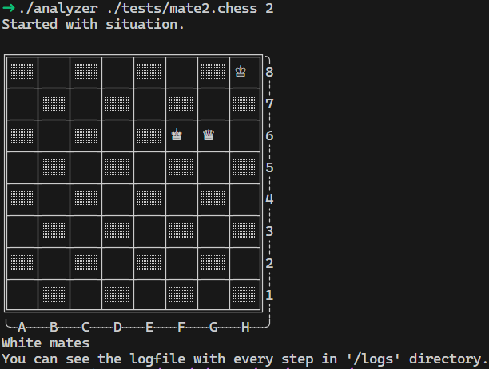

# Chess Analyzer

A C++ command-line application that parses chess board configurations, validates board legality, and analyzes game states—specifically detecting checkmate and stalemate scenarios using a depth-based minimax search algorithm.

## Overview

Chess Analyzer reads chess positions from a configuration file and determines whether White can achieve checkmate or force a stalemate within a specified number of moves. The tool validates board legality, including piece placement rules and king safety constraints, and logs all moves and board states during the analysis.

### Key Features

- **Input Validation**: Comprehensive parsing and validation of chess configurations
- **Board Analysis**: Check, checkmate, and stalemate detection
- **Depth Search**: Minimax algorithm to find mate/stalemate sequences within N moves
- **Detailed Logging**: Automatic generation of analysis logs showing the move sequence and board state at each step
- **Error Reporting**: Clear error messages for invalid configurations with helpful hints

## Building and Running

### Prerequisites

- **C++17** compiler (g++ 7.0+)
- **Make** build tool
- Standard UNIX/Linux environment (or Windows with WSL/MSYS2)

### Build

```bash
make
```

This produces an executable named `analyzer`.

### Run

```bash
./analyzer <config-file> <depth>
```

**Arguments:**
- `config-file`: Path to a `.chess` file containing the initial board configuration
- `depth`: Number of moves White is allowed to force mate/stalemate (N in "mate in N")

**Example:**
```bash
./analyzer tests/mate1.chess 3
```

### Clean

```bash
make clean   # Remove object files
make fclean  # Remove object files and executable
```

---

## Input Format

Configuration files must use the `.chess` extension and contain one piece per line in the following format:

```
<piece-type> <position> <color>
```

### Piece Types (abbreviations)

| Type   | Code | Moves Like                |
|--------|------|--------------------------|
| King   | `KG` | One square in any direction |
| Queen  | `QU` | Any number of squares horizontally, vertically, or diagonally |
| Rook   | `RK` | Any number of squares horizontally or vertically |
| Bishop | `BP` | Any number of squares diagonally |
| Knight | `KN` | L-shape (2 squares one direction, 1 square perpendicular) |
| Pawn   | `PW` | One square forward (capture diagonally) |

### Position Format

- File: `a–h` (columns) or `A–H`
- Rank: `1–8` (rows, where 1 is White's side, 8 is Black's side)
- Examples: `e4`, `F7`, `a1`, `H8`

### Color

`white` or `black`

### Example Configuration

```
KG e1 white
QU d1 white
RK a1 white
RK h1 white
BP c1 white
BP f1 white
KN b1 white
KN g1 white
PW a2 white
PW b2 white
...
KG e8 black
QU d8 black
RK a8 black
RK h8 black
...
```

---

## Validation Rules

The parser enforces strict chess rules during initialization:

- **King Count**: Each color must have exactly one king
- **Pawn Count**: Maximum 8 pawns per color
- **Total Piece Count**: No more than 16 pieces per color
- **Pawn Placement**: Pawns cannot be on the first (rank 1) or last (rank 8) rows
- **King Safety**: Kings cannot be adjacent to each other
- **Duplicate Positions**: No two pieces can occupy the same square
- **Check Legality**: A legal position cannot have both kings in check

---

## Modules

### 1. **Parser** (`parser/`)

**Responsibility:** Input validation and board initialization.

**Files:**
- `parser.cpp` / `parser.hpp` – Main parsing logic
- `parser_utils.cpp` – Utility functions (position conversion, color parsing, etc.)
- `config_validation.cpp` – Validation rules for piece counts and placement
- `checkers.cpp` – Helper functions for checking rule violations

**Key Functions:**
- `parse_config(filename)` – Reads `.chess` file and returns a valid `Chessboard`
- Position validation (file/rank parsing)
- Piece type and color parsing
- Comprehensive error reporting with hints

**Validates:**
- File extension (`.chess`)
- Piece syntax (type, position, color)
- Chess placement rules (pawn position, king adjacency, etc.)
- Board state legality (no duplicate positions, max piece counts)

---

### 2. **Figures** (`figures/`)

**Responsibility:** Piece representation and movement rules.

**Files:**
- `figures.cpp` / `figures.hpp` – Piece classes and movement logic

**Key Classes:**
- `Figure` – Abstract base class for all pieces
- Derived classes: `King`, `Queen`, `Rook`, `Bishop`, `Knight`, `Pawn`

**Key Methods:**
- `get_possible_moves(x, y, board)` – Returns all squares a piece can move to from a given position
- `is_enemy(other_color)` – Color comparison for capture rules

**Responsibilities:**
- Each piece type implements its movement rules
- Handles piece color and movement constraints
- Supports move generation for the engine

---

### 3. **Chessboard** (`chessboard/`)

**Responsibility:** Board state representation and move execution.

**Files:**
- `chessboard.cpp` / `chessboard.hpp` – Board state and operations

**Key Class:** `Chessboard`

**Key Methods:**
- `Chessboard(figures)` – Constructor from a vector of figures
- `get(x, y)` – Retrieve piece at position
- `set(x, y, piece)` – Place piece at position
- `make_move(move)` – Execute a move and update board state
- `unmake_move(move)` – Undo a move (for search)
- `display()` – Print the board to console
- `empty()` – Check if board has no pieces

**Responsibilities:**
- Maintains an 8×8 grid of pieces
- Handles move execution and undo (critical for minimax search)
- Provides board display for user feedback
- Manages piece ownership and captures

---

### 4. **Engine** (`engine/`)

**Responsibility:** Game analysis and move generation using minimax search.

**Files:**
- `engine.cpp` / `engine.hpp` – Analysis and search logic

**Key Class:** `Engine`

**Key Methods:**
- `generate_legal_moves(color)` – All legal moves for a color (excludes moves that leave king in check)
- `is_king_in_check(color)` – Detects if the king is under attack
- `is_square_attacked(x, y, by_color)` – Checks if a square is attacked by a given color
- `is_checkmate(color)` – King in check and no legal moves
- `is_stalemate(color)` – King not in check but no legal moves
- `mate_in_n(attacker, side_to_move, depth, line)` – Minimax search for checkmate within N moves
- `stalemate_in_n(attacker, side_to_move, depth, line)` – Minimax search for forced stalemate

**Responsibilities:**
- Move legality validation (ensuring king safety)
- Game state evaluation (check, mate, stalemate)
- Depth-based minimax search to find forced sequences
- Returns move sequences as `std::vector<Move>`

**Algorithm Details:**
- Recursive minimax with depth limit
- Alternates between attacker and defender
- Prunes branches where illegal moves occur
- Captures and stores the move sequence leading to mate/stalemate

---

### 5. **Logger** (`logger/`)

**Responsibility:** Logging analysis results and board progression.

**Files:**
- `logger.cpp` / `logger.hpp` – Log file generation

**Key Class:** `Logger` (Singleton pattern)

**Key Methods:**
- `Logger& create_logger()` – Obtains the singleton logger instance
- `create_log(board, moves)` – Generates a timestamped log file with initial board and all moves

**Responsibilities:**
- Singleton pattern ensures a single logger instance
- Generates timestamped log files in the `logs/` directory
- Logs the initial board configuration
- Logs each move and the board state after that move
- Provides detailed move-by-move analysis for verification

**Log Format:**
- Filename: `log_<timestamp>.txt`
- Contents: Initial board state, then each move with resulting board configuration

---

### 6. **Main Entry Point** (`main.cpp`)

**Responsibility:** Command-line interface and program orchestration.

**Key Logic:**
1. Validates command-line arguments (config file, depth)
2. Parses the configuration file using the Parser module
3. Checks for empty or illegal board states
4. Creates an Engine instance with the board
5. Searches for checkmate or stalemate up to the specified depth
6. Logs results if a sequence is found
7. Reports analysis outcome to the user

**Output:**
- Console feedback on whether mate/stalemate was found
- Path to the generated log file (if applicable)

---

## Example Workflow

```

```

The program found that White can force checkmate within 3 moves. A detailed log is generated in `logs/log_<timestamp>.txt`.

---

## Test Files

Test configurations are provided in the `tests/` directory:

- `mate1.chess` – Simple checkmate scenario (mate in 1)
- `mate2.chess` – Mate in 2
- `mate3.chess` – Mate in 3
- `mate4.chess` – Mate in 4
- `stalemate.chess` – Stalemate position
- `checkmate.chess` – Illegal: already in checkmate
- `empty.chess` – Illegal: no pieces on board
- `invalid_piece.chess` – Illegal: invalid piece type
- `invalid_pos.chess` – Illegal: invalid position format
- `duplicate_pos.chess` – Illegal: duplicate piece coordinates
- `pawn_first_rank.chess` – Illegal: pawn on rank 1
- `two_white_kings.chess` – Illegal: multiple kings per color

---

## Architecture Summary

```
main.cpp
  ├─> Parser (reads & validates .chess file)
  │    └─> Figures (piece definitions)
  │    └─> Chessboard (from parsed data)
  │
  ├─> Engine (analyzes position)
  │    ├─> Chessboard (board state)
  │    ├─> Figures (move generation)
  │    └─> Recursive minimax search
  │
  └─> Logger (if mate/stalemate found)
       └─> Write results to logs/ directory
```

---

## Error Handling

All parsing errors include:
- Error message describing the problem
- Hint with expected format or rule violated
- Colored output (red for errors, green for success)
- Graceful exit with non-zero return code

Example error:
```
Error: pawns can't be placed on first or last rows in initialization stage
Hint: config must contain -> the type of figure (QU, KG, BP, KN, RK, PW), 
position (f7, B4, e3, A1 or other) and color of figure (white/black)
```

---

## Technical Highlights

- **C++17 Standard**: Modern features like `std::unique_ptr`, move semantics
- **Object-Oriented Design**: Clear class hierarchies and responsibilities
- **Memory Safe**: Smart pointers for automatic cleanup
- **Efficient Search**: Minimax with board state undo/redo
- **Robust Validation**: Multi-level input checking
- **Singleton Pattern**: Logger implementation

---

## Future Enhancements

- Alpha-beta pruning for deeper search
- Opening book handling
- Support for FEN (Forsyth-Edwards Notation)
- Analysis depth optimization with transposition tables
- Interactive move input (instead of file-based)

---

## License

This project is created for educational purposes.
